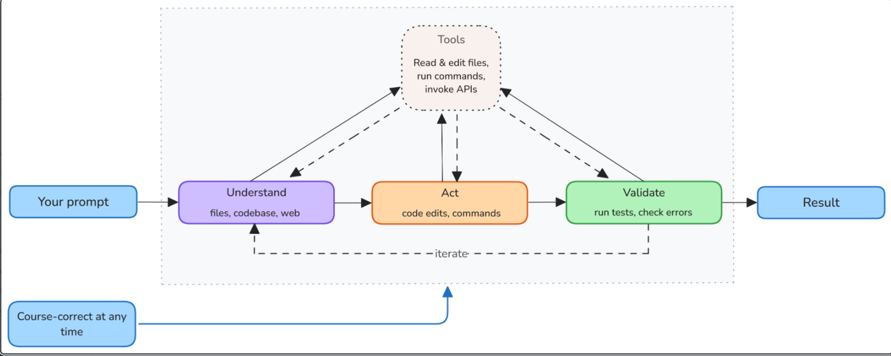

# VSC AI myšlienky  

<[Agenti](https://code.visualstudio.com/docs/agents/concepts/agents)>

Agent je systém AI, ktorý používa jazykový model a nástroje na dokončenie cieľa vo vašom mene.  

## Modely  

<[Jazykové modely](https://code.visualstudio.com/docs/agents/concepts/language-models)>

Jazykové modely nespúšťajú kód ani nepristupujú priamo k súborom. Namiesto toho generujú text, ktorý agentská slučka interpretuje ako akcie.  
Jazykový model spracováva textový vstup (tzv. "prompt") a generuje textový výstup.  
Vo VS Code je výzva zostavená z viacerých zdrojov: vašej správy, histórie konverzácie, obsahu súboru, výstupov nástrojov a vlastných inštrukcií.  
Model generuje odpovede, ktoré môžu zahŕňať vysvetlenia, úpravy kódu alebo požiadavky na zavolanie nástrojov.  

### Context window  

Kontextové okno je celkové množstvo informácií, ktoré model dokáže spracovať v jednej požiadavke.  
Obsahuje všetko: systémovú výzvu, vlastné inštrukcie, históriu konverzácií, obsah súborov, výstupy nástrojov a vašu aktuálnu správu.  
Rôzne modely majú rôzne veľkosti kontextových okien.  
<[Pochopte kontext v AI agentoch](https://code.visualstudio.com/docs/agents/concepts/context)>  
